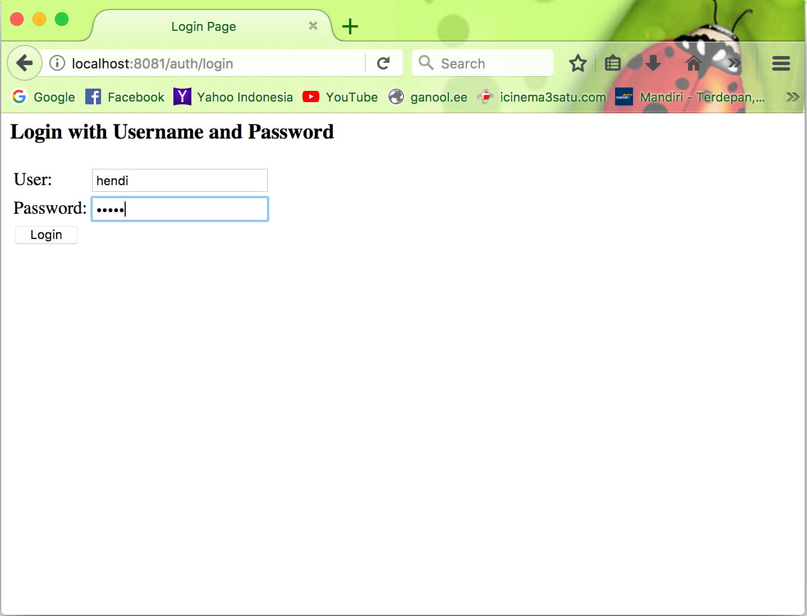
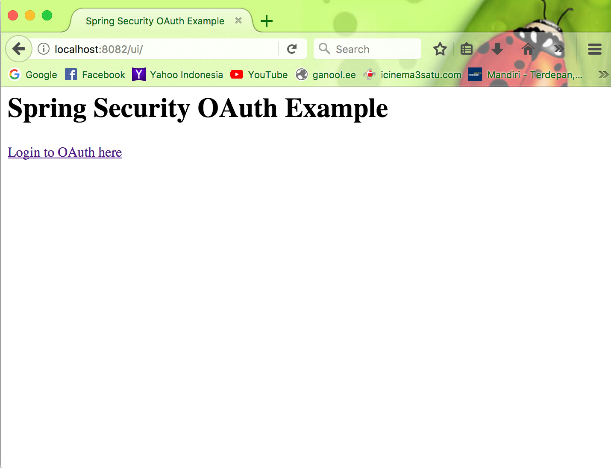
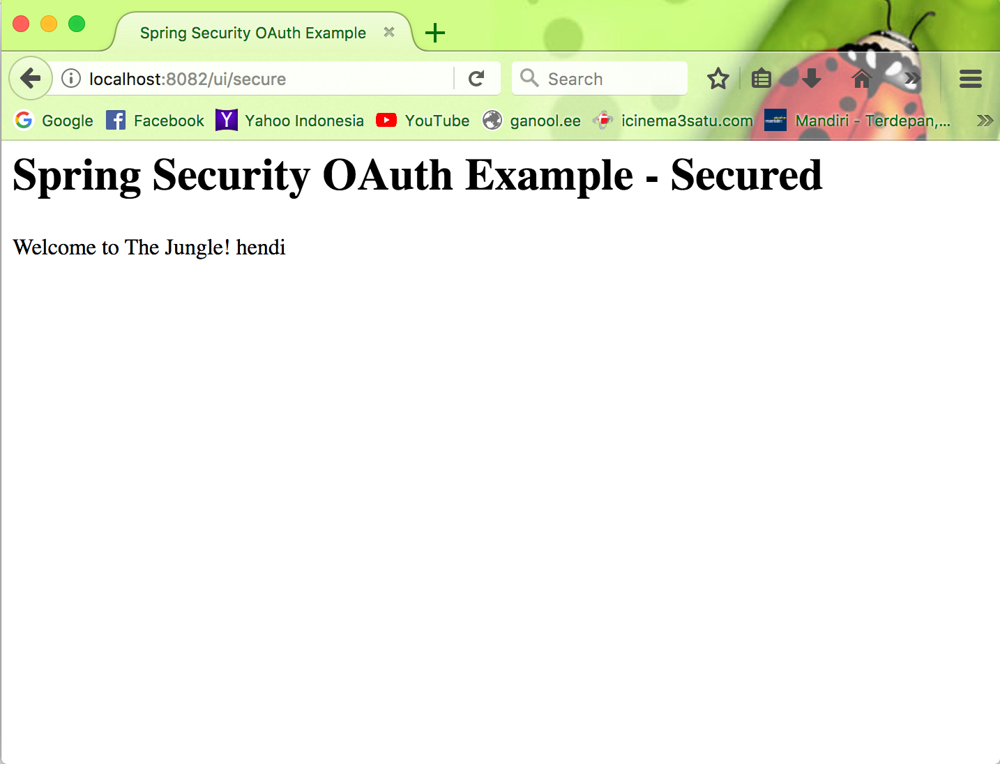

# Spring Security OAuth Example

- `spring-security-client` - Client Project which has the UI

-   Login `http://localhost:8081/auth/login`

- `spring-security-auth-server` - Has the Authorization Server and Resource Server

-   Login `http://localhost:8082/ui``

- `http://localhost:8082/ui` - REST end point for UI which will take you to the secure URI `http://localhost:8082/secure` after logging into the auth server `http://localhost:8081/auth/login`

